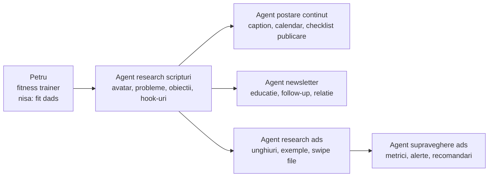
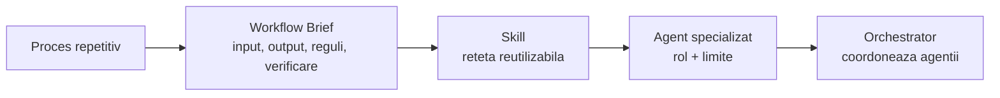
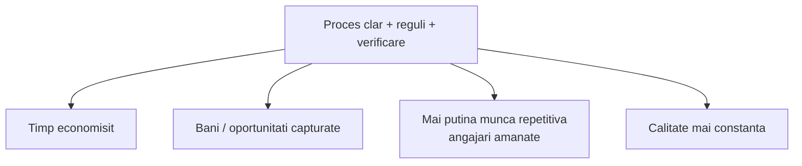

# Ziua 1 - Materiale vizuale v1

> Status: v1 de lucru.
> Scop: schiță pentru slide-uri / vizuale folosite în Ziua 1.

## Vizual 1 - Harta agenților lui Petru

### Rol în workshop

Acest vizual apare în blocul 10-20.

Scopul lui este să creeze efectul wow controlat: participanții văd sistemul complet, dar înțeleg că în Ziua 1 alegem doar prima piesă.

### Mesaj principal

**Petru nu are nevoie de un prompt. Are nevoie de o echipă de agenți. Dar echipa începe cu un proces clar.**

### Diagramă

### Cum îl explici

Spui:

> Asta este harta completă. Petru poate ajunge să aibă agent pentru research, agent pentru postare, agent pentru newsletter, agent pentru ads și agent care supraveghează reclamele.

> Dar observați ordinea. Nu începem cu postarea automată. Începem cu research-ul, pentru că el hrănește toate celelalte piese.

### Punct de accent

**Research-ul este fundația sistemului. Dacă direcția este slabă, tot ce urmează devine slab: postări, newsletter, ads și optimizare.**

### Ce trebuie să rămână în mintea participantului

- agentul nu este magie;
- agentul are un rol clar;
- fiecare agent are un proces în spate;
- sistemul complet se construiește gradual;
- Ziua 1 alege prima piesă, nu construiește tot.

## Vizual 2 - De la proces la sistem AI

### Rol în workshop

Acest vizual poate apărea în blocul 0-10 și revine la final.

Scopul lui este să arate progresia celor 4 zile.

### Mesaj principal

**Nu sărim direct la agent. Construim treptat: proces -> brief -> skill -> agent -> orchestrator.**

### Diagramă

### Cum îl explici

Spui:

> Dacă sari direct la agent, riști să ai un demo frumos, dar greu de folosit. Dacă începi cu procesul, poți construi ceva repetabil.

> Ziua 1 este despre proces și brief. Ziua 2 este despre skill și agent. Ziua 3 este despre browser, MCP și orchestrator. Ziua 4 VIP este despre aplicare pe cazuri reale.

## Vizual 3 - Generalizare pe orice business

### Rol în workshop

Acest vizual apare în blocul 80-87 sau în închiderea Zilei 1.

Scopul lui este să scoată participantul din cazul Petru și să îi arate că metoda se aplică în businessul lui.

### Mesaj principal

**Cazul Petru este sandbox-ul. Metoda se aplică în orice business care are procese repetitive.**

### Tabel vizual

| Întrebare | Petru / fit dads | Orice business |
|---|---|---|
| Cine este publicul? | tați ocupați | client ideal / pacient / lead / client B2B |
| Ce se repetă? | research conținut | follow-up, suport, raportare, programări, ofertare |
| Ce input există? | nișă, canale, limite | mesaj client, formular, date publice, notițe, FAQ |
| Ce output vrem? | hook-uri, scripturi, direcție | răspuns, sumar, email, raport, checklist, ofertă |
| Unde verifică omul? | Petru aprobă conținutul | owner, manager, recepție, consultant, echipă |
| Care este miza? | conținut mai bun și timp salvat | timp, bani, muncă repetitivă, calitate |

### Cele 4 beneficii

### Cum îl explici

Spui:

> Nu contează dacă ești fitness trainer, cabinet, consultant, agenție sau business local. Întrebarea este aceeași: ce proces se repetă, ce input are, ce output vrem și unde verifică omul?

> De aici apar cele patru beneficii: economisești timp, reduci bani pierduți, eviți muncă repetitivă sau angajări premature și crești calitatea.

## Vizual 4 - Workflow Brief v1

### Rol în workshop

Acest vizual apare în blocul 55-70 și poate fi folosit și în tema de final.

### Mesaj principal

**Workflow Brief-ul este puntea dintre idee vagă și workflow controlabil.**

### Tabel slide

| Câmp | Întrebarea simplă |
|---|---|
| Proces | Ce se repetă? |
| Input | Cu ce începe? |
| Pași actuali | Cum se face acum manual? |
| Output | Ce rezultat vrem? |
| Reguli/limite | Ce are voie și ce nu are voie AI-ul? |
| Verificare | Unde intră omul? |
| Miză | De ce merită? |

### Cum îl explici

Spui:

> Dacă nu poți completa acest brief, încă nu ai un proces pregătit pentru agent. Ai doar o dorință vagă de automatizare.

## Ordine recomandată în slide-uri

1. Traseul celor 4 zile: proces -> brief -> skill -> agent -> orchestrator.
2. Harta agenților lui Petru.
3. Procesul ales: research scripturi `fit dads`.
4. Workflow Brief v1.
5. Mini-demo Claude.
6. Generalizare pe orice business.
7. Tema: completează propriul Workflow Brief v1.

## Guardrails vizuale

- Nu folosi vizualuri care sugerează că AI-ul decide singur.
- Nu folosi „autopilot” ca mesaj principal.
- Nu face harta agenților să pară că toate piesele se construiesc în Ziua 1.
- Nu încărca slide-urile cu jargon tehnic.
- Pentru MCP și Playwright, folosește doar teaser în Ziua 1.

